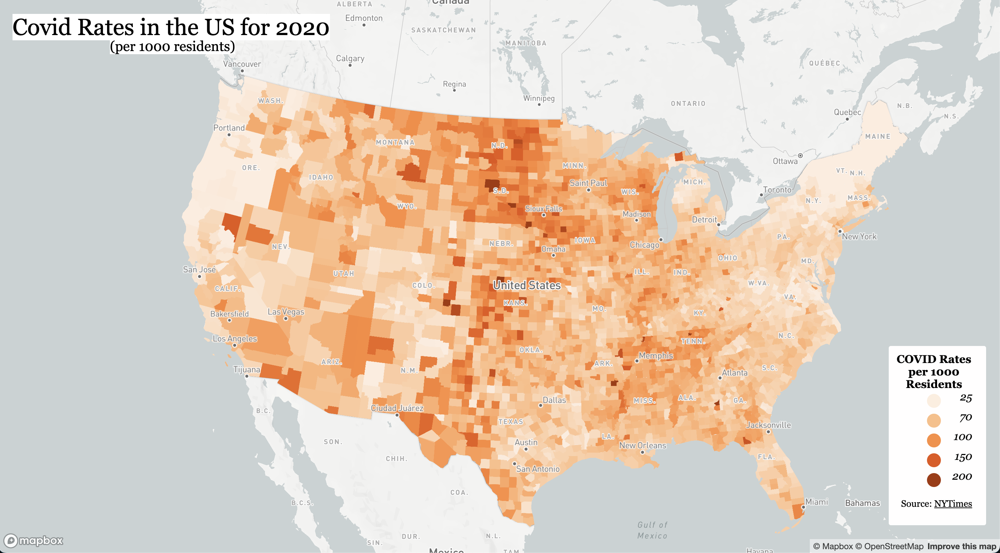
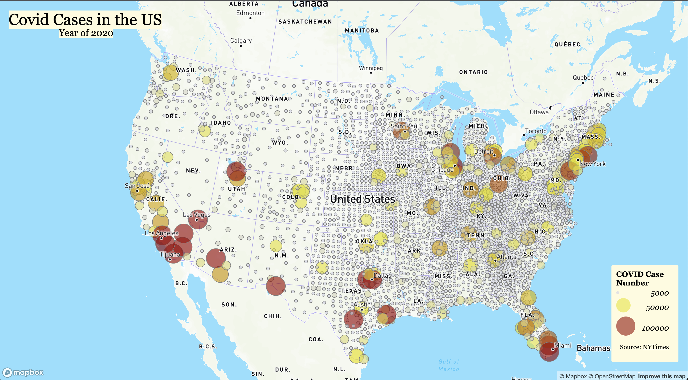

# CovidMaps

In this lab you will see two COVID-19 maps produced with data from 2020. The first [map](https://tnh333.github.io/CovidMaps/map1.html) is a cloropleth map of Covid rates per 1000 residents by county in the United States. Each county is distributed into one of five categories representing the estimate rate of the county. The lighter the color the less the rate is and the darker the color the higher the rate of covid is in that county. When clicking on any given county there will be a pop-up showing the name of the county and the covid rate in that county per 1000 residents. The second [map](https://tnh333.github.io/CovidMaps/map2.html) is a proportional sympbol map representing the counts of Covid cases per county in the United States. Each dot is an estimate of what each county recorded for covid cases. The largest dot shows the most cases and the smallest shows the least. When clicking on a dot you will see a pop-up of the name of the county and the exact covid case amount for that county. The data for both maps come from the [New York Times](https://github.com/nytimes/covid-19-data/blob/43d32dde2f87bd4dafbb7d23f5d9e878124018b8/live/us-counties.csv). Both maps data were adjusted and converted to geojson with [QGIS](https://qgis.org/en/site/), the basemaps come from [mapbox](https://www.mapbox.com/), the shapefile data comes from the [USCensus](https://www.census.gov/geographies/mapping-files/time-series/geo/carto-boundary-file.html), and both maps were created using [VSCode](https://code.visualstudio.com/).

### Map 1: Covid-19 Rates

### Map 2: Covid-19 Cases

